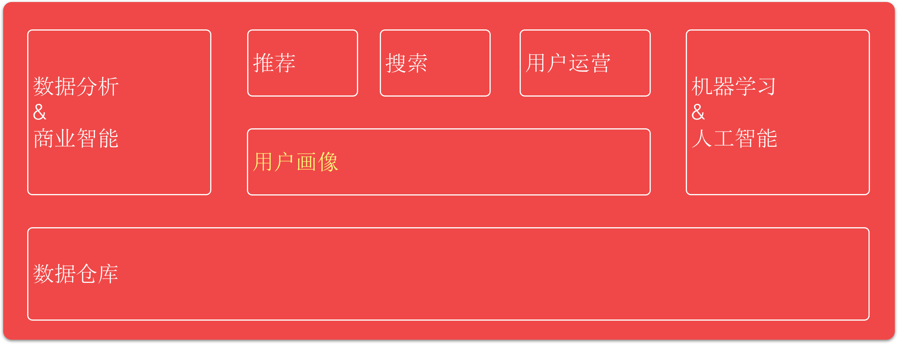
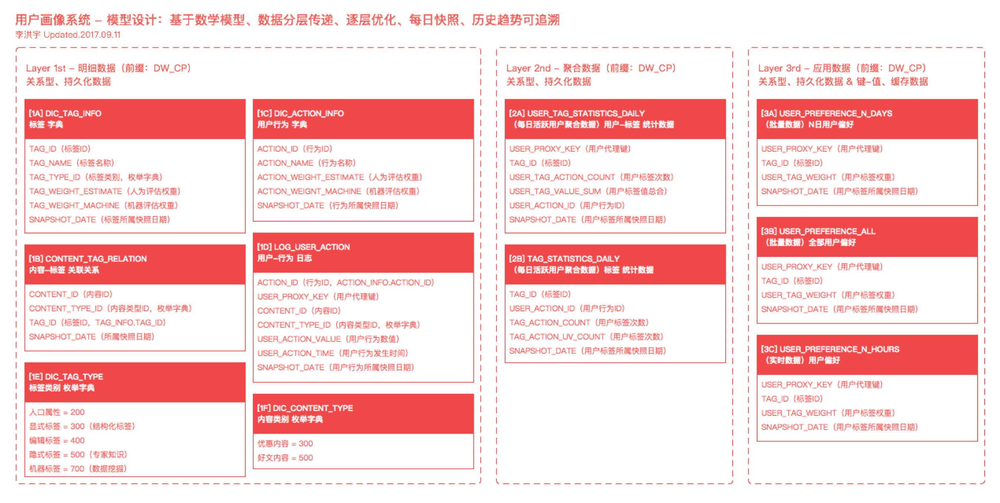
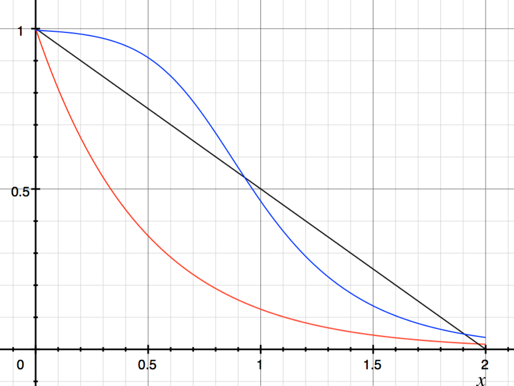
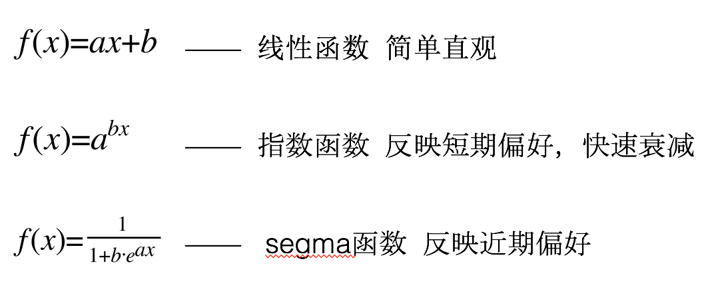
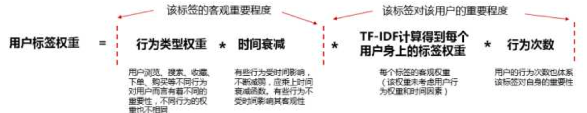
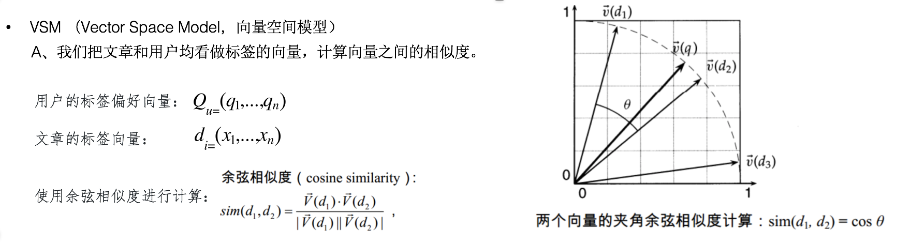
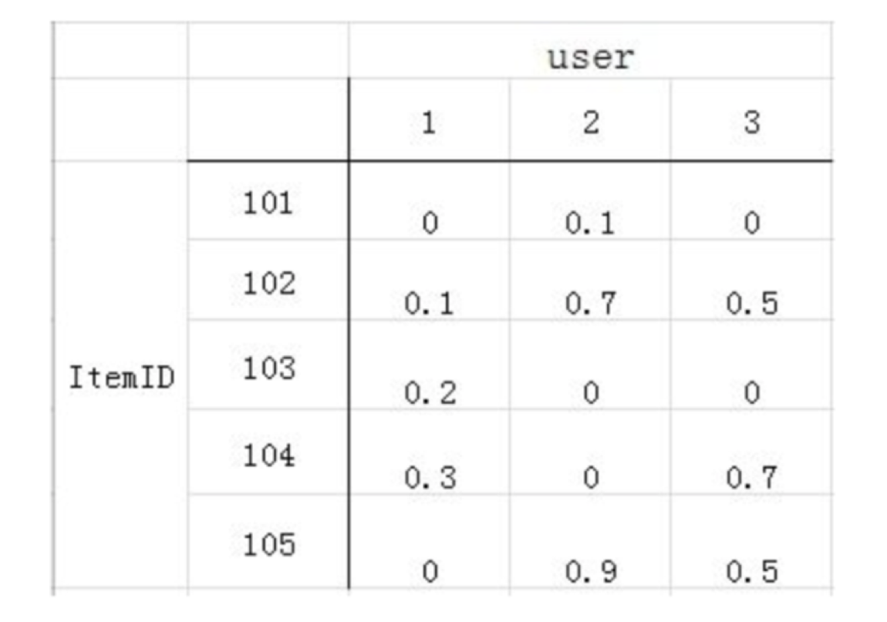
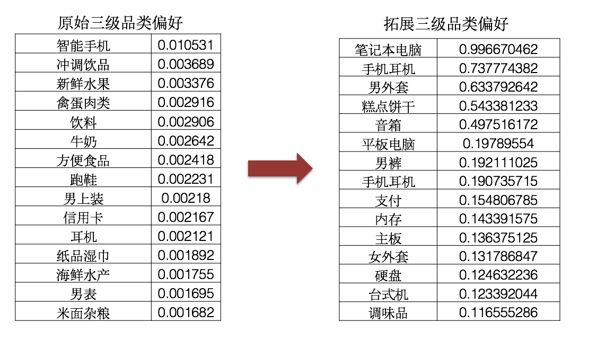

@title[Intro]
## 值得买 用户画像系统实践
 
#### 基于千人千面业务
 

 <b>Copyright (c)</b> [侯志伟/算法工程师](https://github.com/hohooo)

---
@title[MENU]
## 目录
 

- 用户画像简介 |
- 值得买的用户画像实践 |
- 用户画像应用与技术前沿 |
- 用户画像助力业务增长 |

---
@title[Introduction]
## 用户画像简介
 

- 挑战：在信息大爆炸时代，用户的个性化需求不断提高。
- 对策：目前信息处理系统有两种工作模式。
  - 第一种是“拉”模式，用户提交查询，搜索引擎返回搜索结果;
  - 第二种是“推”模式，用户不需要显式提交任何查询和兴趣偏好，推荐系统通过自动化算法来进行“信息”推送。在信息智能时代，推荐系统已经成为互联网以及数据服务公司的核心技术产品。

- 推荐系统的终极目标就是能够理解用户，理解用户核心技术之一就是用户画像构建。

+++
@title[define]
### 用户画像的定义

- Personas are a concrete representation of target users. via Alan Cooper （交互设计之父）
>Persona 是真实用户的虚拟代表,是建立在一系列真实数据(Marketing data,Usability data)之上的目标用户模型，通过用户调研去了解用户,根据他们的目标、行为和观点的差异,将他们区分为不同的类型,然后每种类型中抽取出典型特征,赋予名字、照片、一些人口统计学要素、场景等描述,就形成了一个人物原型。via 知乎

+++
@title[define2]
### 用户画像的定义
- 一言以蔽之，即 你的行为决定了你是谁 

> 在应用信息系统中，利用用户的相关数据(如文本、图片、行为等)来构建未知的用户属性特征等重要信息，即通过数据，得到用户的可量化的信息表示包括简单的属性特征(如年龄、性别等)以及复杂的模式特征(如网络隐含表示等)

+++
@title[Embed Images]
## 用户画像-双刃剑

<big><big>"Big <del>brother</del> data is watching you……"</big></big>

<big><big>可怕！我们几乎都没有了隐私T.T</big></big>

<big><big>惊喜！它比我寄几都了解我寄几:D</big></big>

 

@fa[arrow-down]

+++
@title[Embed Images1]
网易云音乐：“你可能是个作家。”
-来自量化信息的抽象表达

+++
@title[Embed Images2]
keep：“卸了吧，我快要keep不住你的体重了。”

+++
@title[Embed Images3]
>钉钉：“以后别去用钉钉的公司了，不适合你。”

+++
@title[Embed Images4]
>知乎：“谢邀。”

+++
@title[Embed Images5]
>得到：“有中年焦虑的阅读障碍患者。”

---
@title[user_profile in action]
##值得买的用户画像实践

- 值得买用户画像系统2.0，项目开发历时2个月，于2017年10月正式上线，并应用于全站的核心业务千人千面里，帮助业务实现核心架构升级。

- 该系统相较于1.0画像系统，无论在计算精度/运算效率上还是业务应用上，都有明显的优势和创新点。

+++
@title[ES图]
1. 系统完备，拓展性强

+++
@title[时间衰减]
2. 时间衰减，多模多态

通过线性函数、指数函数和segma函数多种方式，实现不同的效果

+++
@title[自然语言处理 TF-IDF]
3. 自然语言处理在推荐系统中的应用
BOW(Bag of Words,词袋模型)
在推荐系统中，把每一个商品看做是一个词袋，我们可以根据袋中的词来召回相关物品，例如用户浏览了一个包含“羽绒服”标签的商品，我们会给用户一个“羽绒服”的标签，同时召回包含“羽绒服”标签的其他商品作为该次推荐的候选商品。
TF-IDF(term frequency–inverse document frequency,词频-逆文件频率)
简而言之，一个标签的重要性随着它被用户点击的次数成正比，随它在整个商品集中出现的次数成反比。这样可以保证分发量少的标签也能在体系中起到作用。

+++
4. 自然语言处理在推荐系统中的应用

+++
5. 用户拓展偏好-刷屏的画像侧解决
场景：用户偏好少或者用户偏好过于集中，使得用户刷屏
解决方案：基于用户偏好，使用 基于人的协同过滤的算法(user_based CF)，得到用户的拓展偏好，作为画像的补充。
偏好矩阵：

计算用户之间(偏好向量)的相似度，来补充用户画像，作为拓展偏好：

+++
6. 用户偏好调和-泛偏好和精确偏好的冲突
场景：站内文章的品类为树状结构，所以当用户的偏好集中在某个三四级品类时，也会推荐其所属的一二级品类。
解决方案：基于用户的多级品类偏好，求取用户偏好在上一级品类中的分布的变异系数，进而调和用户的泛偏好和精确偏好之间的冲突。
C.V(Coefficient of Variance,变异系数)
     标准差与平均数的比值称为变异系数，用来反映样本在均值上的离散程度。
     用户品类偏好=调和系数 * 品类偏好

+++
7. 效果
- 依赖于该系统的首页千人千面业务，截止到17年12月初，在覆盖首页50%流量覆盖前提下，千人千面版较普通流——人均详情页点击20%的提升，人均电商点击40%的提升。

- 目前该技术是公司千人千面业务的核心，并为精细化推送/搜索/个性化广告/BI数据等服务提供技术与数据支持。

---
## 用户画像应用与技术前沿
用户画像的定义往往依赖于具体的数据源以及任务目标，因此很难有统一的呈现方式。围绕着这 些不同的定义以及具体的任务，学术界和工业界提出了很多技术手段来构建用户画像。
第一类为显式的用户特征抽取或者简单加工，易于理解;
第二类为用户特征的隐含表示以及学习，易于后续的量化计算。
同时，在推荐系统中，与用户画像相对应，进一步介绍受众画像(即商品或内容的画像)的构建方法。

隐含用户画像的构建方法

基于主题模型的用户画像构建

基于主题模型的用户画像构建方法假设用户的 画像属性(地域、职业、年龄等)与其在社交媒体 发布文本内容的主题是有较强关联性的，例如，程 序员更多提及的主题可能包括编程语言、开发工 具等，而医生更多的是在讨论医院、药品等。通 过从用户所发表的文本数据中抽取隐含的主题信 息，进而将用户兴趣刻画为主题集合上的概率分 布，作为用户画像的量化表示。可以使用多种主题 模型用于用户画像构建，这些方法主要是在 LDA (Latent Dirichlet Allocation) 模型 [11] 上进行改进与 扩展，陆续出现了 ATM[12] 、ARTM[13]、APTM[14]、 AITM[15]、LITM[16]、Topic-link LDA[17] 等多种模型。 ATM(Author-Topic Model) 是从作者的角度考虑文本 中主题的生成。针对学术文章语料数据集，ATM 对于每个作者不再限定该作者只能对应一个主题，而 是对应于一个主题分布，所有作者共享一个主题集 合。ARTM(Author-Recipient-Topic Model) 是在 ATM 基础上提出来的，其重点考虑信息传递过程中发送 者和接受者之间的角色关系，比较典型的有电子邮 件收发者之间的关系，增加对接受者信息的考虑而 进行用户建模。APTM(Author-Persona-Topic Mod- el)，从角色的生成方式对ARTM进行扩展。在ATM 和 ARTM 基础上，可以进一步考虑用户兴趣和主题 的关系，例如 AITM(Author Interest Topic Model) 和 LITM(Latent-Interest-Topic Model)。刘 (Liu) 等人 [17] 认为用户在社交媒体上发布的文本主题与其社交关 系有着较强的内在联系，因此将主题模型及用户的 社交网络关系联合建模学习。基于主题的用户画像 表示，能够有效描述用户兴趣的多样性，而且主题 数量远远小于标签(如关键字)的数量，形成了一 个用户信息的隐含低维表示，减少了所需要的存储 空间和应用复杂度。此外，基于主题的用户模型可 以将用户和各种资源(如文本)通过主题进行关联， 充分利用挖掘数据信息中的用户特征。

基于深度学习的用户画像构建
近年来，深度学习方法使很多任务的完成效果 得到了提升。其中很重要的原因就是引入了分布式 表示的思想，以及对于深度模型的有效(效果和速 度上)训练方法。利用分布式表示学习方法刻画用 户社交关系网络，对于构建用户画像起着至关重要 的作用。佩罗齐 (Perozzi)[18] 等人提出了 DeepWalk 的方法，通过在网络中随机游走的方式产生若干随 机序列化路径，然后通过 Skip-gram 模型对节点的 隐含向量进行更新，从而学习到节点的低维表示。 给定一个用户的社交关系网络，可以使用 DeepWalk 算法得到用户的分布式表示。这种低维的隐含向量 可以作为用户画像的量化表示。
DeepWalk 是一种较为通用的图结构分布式表 示学习方法，它可以产生一般化的用户分布式表示 从而用于多种任务。然而，这种方法没有利用任何 有标记的数据，其结果是产生的向量不具有任务针 对性。为了提升用户画像构建的效果，文献 [19] 在DeepWalk 得到的随机游走路径中引入用户的标记信 息，然后在新的路径中学习用户的分布式表示。如 原路径为 :user1 → user2 → user3 →⋯→ usern，引入 有监督信息 (label) 以后路径变为 :user1 → label1 → user2 → label2 → user3 → label3 →⋯→ usern → labeln， 从而使得 DeepWalk 学习出来的用户分布式表示更 适用于特定任务。
对于用户画像构建任务，如何将用户的其他信 息(例如文本特征)和社交网络结构信息融合使用， 是最近用户画像领域的研究热点。比较直接的一种 联合学习方法是对于每种信息分别学习出表示向 量，然后进行组合形成一个新的用户向量 [19]。然而 这种方法并没有充分挖掘文本数据以及社交网络之 间的关联关系。缪拉 (Miura) 等人 [20] 在学习用户的 文本分布式表示和关系分布式表示的基础上，提出 了基于注意力机制的神经网络模型，该模型可以将 二者进行融合。孙 (Sun) 等人 [21] 则是在 DeepWalk 框架基础上，将文本信息看成一种特殊的网络节点， 将用户文本信息和社交网络信息映射到统一的向量 空间，并且在模型训练过程中联合训练二者的分布 式表示。通过这种方式使得网络结构的损失能同时 反向传播到文本和网络节点上，从而学习出文本和 网络结构的联合表示。

受众画像的构建
除了用户画像以外，还可以考虑对物品建立受 众画像。例如，一款产品的受众特征可以刻画为“单 身未婚女性、年龄 18~24 岁、大学文化程度”。产 品受众画像，指的是一个产品潜在的购买人群的整 体属性特征。产品受众群体属性特征提供了一款产 品的候选受众的典型个人特征，对于产品销售和推 广具有重要意义。图 1 展示了一款产品在年龄和兴 趣两个维度受众用户的属性分布。在文献 [1, 2] 中，主要利用以下两种社交数据 进行产品受众特征的学习。

利用电商平台的评论信息 :用户有时候会在 产品评论中显式地提及与受众属性相关的信息。例 如，“这款手机不错，给儿子买一个”。暗示当前的产品适合该评论者的儿子，也就是他的儿子是该产 品的一个潜在受众，同时也可以推断 [ 年轻 ] [ 男士 ] 是受众的两个特征。
利用微博平台的关注信息 :在微博中，用 户可以自由地表达自己对于某款产品或者品牌的情 感。如果情感取向为“正”(褒)，就可以把当前用 户当作一个潜在的产品受众。搜集这样的正向情感 用户，聚合他们的个人属性信息，可以推断该产品 的受众特征。通过用户行为来捕捉用户对于某一产 品的正向情感，包括关注关系 (following) 和提及关 系 (mentioning) :如果一个用户对某一产品感兴趣或 者己经使用过该产品，则他很有可能通过发表状态 文本的形式来表达自己对于该产品的情感取向。给 定一款产品，可以使用产品名来检索得到所有包含 该产品名字的微博，然后使用基于机器学习的方法 来判定微博文本中的用户情感取向，把具有正向情 感的用户当作该产品的受众。
通过上述方法对受众属性信息进行统计，然后 以概率形式表示。具体的构建过程为，首先将属性 维度离散化，然后根据收集到的受众属性信息，对 不同维度进行数量更新，统计结束时将数量归一化 成概率，最后得到的概率分布就是受众画像的表示。 每个属性对应一个概率分布。 通过受众属性的分布 特征可以很好地了解一款产品对应受众各种属性信 息的分布情况。

---
## 用户画像助力业务增长

#### Make A Visual Statement

 

Use inline images to lend
a *visual punch* to your slideshow presentations.

+++
@title[Private Investocat]

Inline Image at <b>Absolute URL</b>

the <b>Private Investocat</b> by [jeejkang](https://github.com/jeejkang)

+++
@title[Octocat De Los Muertos]

Inline Image at GitHub Repo <b>Relative URL</b>

the <b>Octocat-De-Los-Muertos</b> by [cameronmcefee](https://github.com/cameronmcefee)

+++
@title[Daftpunktocat]

<b>Animated GIFs</b> Work Too!

the <b>Daftpunktocat-Guy</b> by [jeejkang](https://github.com/jeejkang)

| table | table_name | comment |
| ---- | :------: | :--------: |
| recommend.dw_cp_user_preference_30_days |  用户画像切片表 | 分区表，30天时间衰减后的切片 |
| recommend.dw_cp_user_preference_long_term|   用户画像长期表| 由切片表聚合而成（保留最近切片），写入最终 redis 里|
| recommend.tag_relation_user_preference| 用户拓展偏好| 基于用户特征的协同过滤得到的用户可能偏好，只包含三级品类 top50，非分区表，保留最新的切片|
| recommend.cold_start_user_preference| 新用户引导-临时画像表| 基于用户主动点击标签反馈得到的临时画像（8.7上线），hive 保存最近一个月数据，mysql 保留全量数据|
| recommend.cold_start_user_preference_guess| 新用户引导-临时画像拓展偏好表| 基于用户主动点击标签关联得到用户可能偏好，只包含1、2级品类（8.7上线），hive 保存最近一个月数据，mysql 保留全量数据|

---

[车联网用户画像系统 @fa[external-link gp-download]](https://www.slideshare.net/ssuserfe03a9/ss-76349106)

---

### Questions?

 

@fa[twitter gp-contact](@gitpitch)

@fa[github gp-contact](gitpitch)

@fa[medium gp-contact](@gitpitch)

### Template Versions

[Speaker Notes @fa[external-link gp-download]](https://gitpitch.com/gitpitch/templates/netflix?p=speaker)

---

---?code=src/go/server.go&lang=golang&title=Golang File

@[1,3-6](Present code found within any repo source file.)
@[8-18](Without ever leaving your slideshow.)
@[19-28](Using GitPitch code-presenting with (optional) annotations.)

---?gist=onetapbeyond/494e0fecaf0d6a2aa2acadfb8eb9d6e8&lang=scala&title=Scala GIST

@[23](You can even present code found within any GitHub GIST.)
@[41-53](GIST source code is beautifully rendered on any slide.)
@[57-62](And code-presenting works seamlessly for GIST too, both online and offline.)
---?image=assets/image/gitpitch-audience.jpg

@title[Download this Template!]

### Get your presentation started!
### [Download this template @fa[external-link gp-download]](https://gitpitch.com/template/download/netflix)
